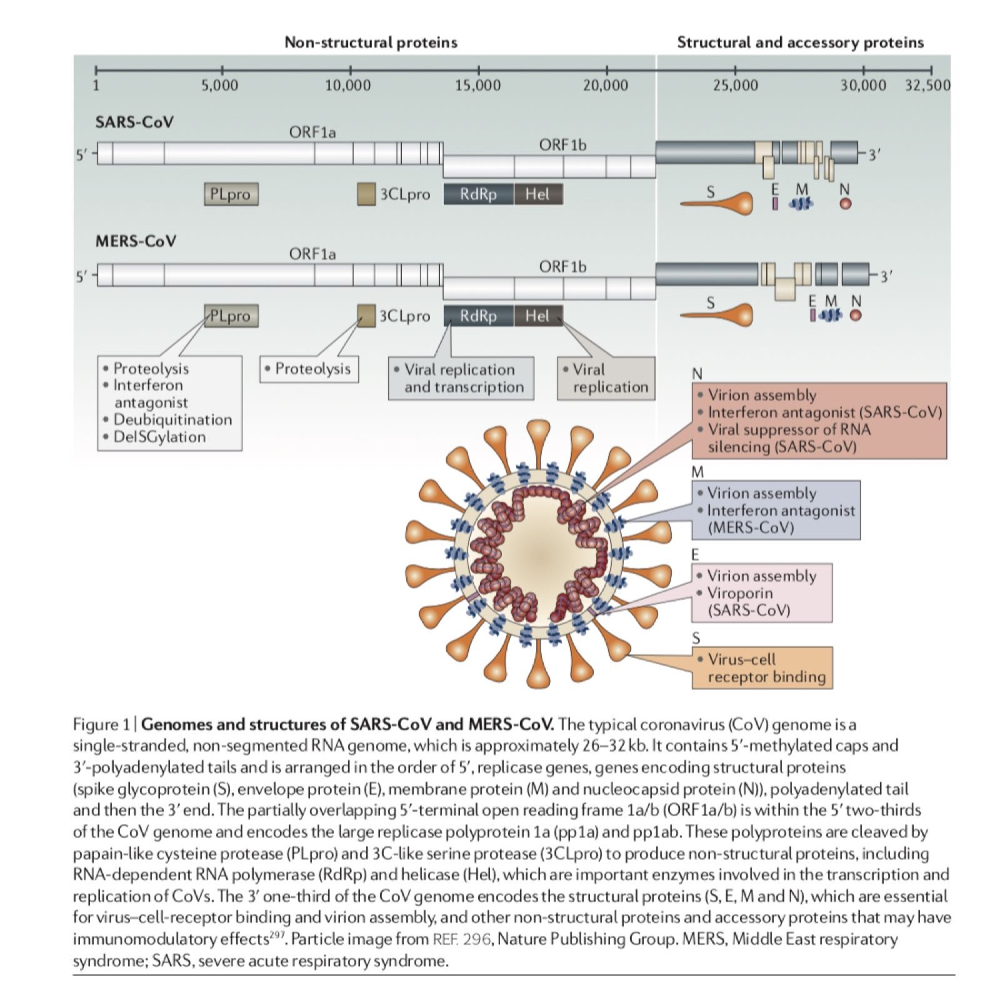

# Covid-19 drug disco 

## Remarks 
* MD simulations 
	- 37C(body temperature), physiological env or counterions.

## Proteins 
Here is a list of drug-targetted proteins from covid-19. 
This list includes the targets and all their alias to avoid confusion in communication. 

Name | alias | Functions | updates
:---|-------|---------- | ---
_**First four targets**_||
NSP15 |  Uridylate-specific endoribonuclease |
NSP3 |  Adipose differentiation-related protein, ADRP || no model or seq
S protein RBD | spike glycoprotein receptor binding domain | Virus-cell binding | needs seperate
3CLpro | C-like serine protease, mpro | Proteolysis 
_**Rest**_||
PLpro | papain-like cysteine protease | Proteolysis, Interferon antagonist(IA) | need improvement, Rosetta 
RdRp | RNA-dependent(directed) RNA polymerase, NSP12 | Viral replication and transcription 
Hel | Helicase, NSP13 | Viral replication 
N protein | nucleocapsid , NC | Virion assembly, IA(SARS-CoV),  Viral suppressor of RNA silencing (SARS) | low coverage, Rosetta 
E protein | envelope | Virion assembly,Viroporin(SARS-CoV)
M protein | membrane | Virion assembly, IA(MERS) | no high-q model, Rosetta

The detailed information about proteins 

## Useful links 
* [Targeting 2019-nCoV Portal](https://ghddi-ailab.github.io/Targeting2019-nCoV/)
* [SWISS-MODEL SARS-CoV-2 Homology Models](https://swissmodel.expasy.org/repository/species/2697049)
* [ViralZone for Coronavirus](https://viralzone.expasy.org/30?outline=all_by_species) 
* [Covid-19 proteome (MN908947)](https://www.ncbi.nlm.nih.gov/ipg/?term=MN908947) 
* [NCBI Genbank SARS-Cov-2 Sequences](https://www.ncbi.nlm.nih.gov/genbank/sars-cov-2-seqs/)

## Meeting notes (03-02-2020)
General problems: 
* Drug screening (inhibitor) 
	- Pocket information (f-pocket)
* Vaccine development support 
	- Compt: predict immune response from certain virus type that triggers immuse response but not viral infection 
* Epidemiology 
	- Spreading model 
* Host response (host-based targets)
* Evaluation of virus (virulence, host adaption, etc)